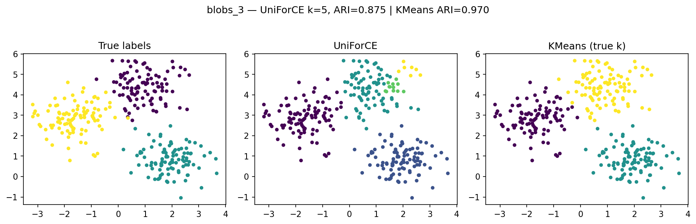
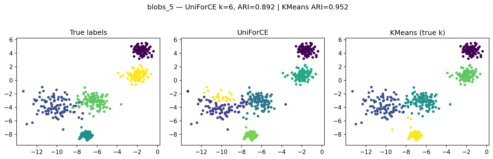

<div class="english-text">
<strong>
  UniForCE
</strong>
</div>

## 👩‍💻 نویسنده

<strong>مهدیه قاسمی</strong>

## 📬 راه‌های ارتباطی

<p align="center">
  <a href="https://github.com/mahdiehgh79">
    
  </a>
  <a href="mailto:mahdiehghasemi79@gmail.com">
    
  </a>
</p>

<a href="https://www.um.ac.ir/" style="text-decoration:underline; color:green;" target="_blank">
<strong>دانشگاه فردوسی مشهد</strong>
</a>

# پیاده‌سازی و تحلیل الگوریتم UniForCE — نسخهٔ DeepSeek

**(Unimodal Forest for Clustering and Estimation of k)**

## فهرست مطالب

1. [مقدمه](#مقدمه)
2. [تعاریف و مبانی ریاضی](#تعاریف-و-مبانی-ریاضی)
3. [شرح الگوریتم (شبه‌کد)](#شرح-الگوریتم-شبه‌کد)
4. [پیاده‌سازی با DeepSeek — فایل‌ها و کد](#پیاده‌سازی-با-deepseek--فایلها-و-کد)
5. [مراحل خوشه‌بندی](#مراحل-خوشهبندی)
6. [تحلیل عملکرد مرحله‌به‌مرحله در کد](#تحلیل-عملکرد-مرحلبهمرحله-در-کد)
7. [آزمایش‌ها، نتایج و مقایسه با KMeans](#آزمایشها-نتایج-و-مقایسه-با-kmeans)
8. [تحلیل گرافیکی نتایج](#تحلیل-گرافیکی-نتایج-خوشهبندی)
9. [جمع‌بندی](#جمعبندی)
10. [نتیجه‌گیری نهایی](#نتیجهگیری-نهایی)
11. [نحوهٔ اجرا (راهنما)](#نحوهٔ-اجرا-راهنما)
12. [منابع](#منابع)

---

## مقدمه

الگوریتم **UniForCE** (Unimodal Forest for Clustering and Estimation of \(k\)) یک روش مبتنی بر شکل چگالی است که هدف آن هم‌زمان خوشه‌بندی و تخمین خودکار تعداد خوشه‌ها است. نسخهٔ DeepSeek که همراه پروندهٔ پروژه ارسال شده، پیاده‌سازی‌ای‌ست بر پایهٔ سه ایدهٔ اصلی:

- Overclustering: تقسیم اولیهٔ فضا به زیرخوشه‌های زیاد برای گرفتن ساختار محلی چگالی.
- Unimodal pair testing: بررسی تک‌وجهی بودن توزیع ترکیبی هر زوج خوشه (با تصویر روی محور مراکز و KDE / آزمون Dip).
- ساخت جنگلِ تک‌وجهی: الحاق خوشه‌ها بر اساس آزمون‌ها و استخراج خوشه‌های نهایی (هر درخت یک خوشه).

هدف این گزارش: ارائهٔ نسخهٔ تمیز، مستندسازی کد DeepSeek، توضیح خط‌به‌خط و فراهم کردن دستورالعمل اجرا و تحلیل نتایج به‌صورت قابل تکرار.

---

## تعاریف و مبانی ریاضی

---### 🔸 **تعریف ۱ — خوشهٔ تک‌وجهی (Unimodal Cluster)**

در مسئلهٔ خوشه‌بندی، یک **خوشهٔ تک‌وجهی** به مجموعه‌ای از نقاط در فضای ویژگی گفته می‌شود که چگالی داده‌ها در آن فقط **یک قله (mode)** دارد.

به‌صورت رسمی، اگر \(C \subseteq X\) یک زیرمجموعه از داده‌ها باشد و \(f_C(x)\) چگالی تخمینی نقاط در آن ناحیه باشد، آنگاه \(C\) را **تک‌وجهی** می‌نامیم اگر:

\[
f_C(x) \text{ تنها یک نقطهٔ بیشینه (mode) داشته باشد.}
\]

---

### 🔸 **تعریف ۲ — آزمون تک‌وجهی بودن دو خوشه (Unimodality Test)**

برای دو خوشه \(A\) و \(B\)، ترکیب آن‌ها را بررسی می‌کنیم تا ببینیم آیا چگالی داده‌های \(A \cup B\) هنوز تک‌وجهی است یا خیر:

\[
\text{Unimodal}(A,B) =
\begin{cases}
\text{True}, & \text{اگر } f\_{A \cup B} \text{ فقط یک قله داشته باشد}, \\[4pt]
\text{False}, & \text{اگر بیش از یک قله داشته باشد.}
\end{cases}
\]

به زبان ساده:

- اگر ترکیب دو خوشه هنوز **یک قله** دارد، آن‌ها را می‌توان **ادغام** کرد.
- اگر ترکیب آن‌ها **چند قله** دارد، باید **جدا** بمانند.

---

### 🔸 **تعریف ۳ — چگالی تخمینی و آزمون Dip**

برای محاسبهٔ تعداد قله‌ها، تابع چگالی ترکیبی \(f\_{A\cup B}\) با **تخمین چگالی هسته‌ای (KDE)** برآورد می‌شود.  
سپس از **آزمون Dip** برای بررسی یکتایی قله‌ها استفاده می‌کنیم.  
تفسیر نتیجه به صورت زیر است:

\[
p =
\begin{cases}
\geq \alpha, & \text{تک‌وجهی (قبول فرضیهٔ صفر)} \\[4pt]
< \alpha, & \text{چندوجهی (رد فرضیهٔ صفر)}
\end{cases}
\]

در اینجا:

- \(p\) مقدار احتمال آزمون Dip است.
- \(\alpha\) سطح معنی‌داری (مثلاً ۰٫۰۱ یا ۰٫۰۵) می‌باشد.

---

### 🔸 **تعریف ۴ — خوشه‌بندی اولیه (Overclustering)**

در مرحلهٔ نخست الگوریتم، داده‌ها با استفاده از **K-Means** با تعداد زیاد خوشه‌ها (\(k_0\)) تقسیم می‌شوند تا ساختارهای محلی به‌خوبی مشخص شوند.  
سپس در مراحل بعدی، خوشه‌های نزدیک با آزمون تک‌وجهی ادغام می‌شوند تا خوشه‌های نهایی شکل گیرند.

---

### 🔸 **تعریف ۵ — برآورد تعداد خوشه‌ها (k)**

تعداد نهایی خوشه‌ها \(k\_{\text{est}}\) برابر است با تعداد مؤلفه‌های همبند در گراف نهایی **جنگل تک‌وجهی (Unimodality Forest)**:

\[
k\_{\text{est}} = |\text{Components of Forest}|
\]

## شرح الگوریتم (شبه‌کد)

```text
INPUT: داده‌ها X، (اختیاری) k_true
1. Overclustering: اجرا KMeans با k0 (k0 >> انتظار برای k) -> بخش‌های محلی
2. برای هر زوج خوشه (A,B):
   a. پروجکت نقاط A∪B روی وکتور c_B - c_A
   b. برآورد چگالی 1D (KDE) و/یا انجام Dip test بر روی توزیع پروژه‌شده
   c. اگر توزیع تک‌وجهی باشد -> علامت Merge(A,B)
3. اعمال الحاقات (greedy یا با الگوریتمی شبیه Kruskal با شرط unimodal)
4. تکرار مراحل 2–3 تا همگرایی
OUTPUT: برچسب‌های نهایی، فهرست خوشه‌ها، و برآورد k
```

---

## پیاده‌سازی با DeepSeek — فایل‌ها و کد

> خلاصه و تمیز شده و فایل پایتونی نهایی `deepseek_uniforce.py` برای اجرای سریع، می‌توانید همین فایل پایتون را اجرا کنید (راهنما در بخش «نحوهٔ اجرا»)

### استخراجِ کلیدی از کد

```python
import numpy as np
from scipy.stats import gaussian_kde
from sklearn.cluster import KMeans
from sklearn.metrics import adjusted_rand_score
import matplotlib.pyplot as plt
import pandas as pd
import os

def count_peaks_1d(data_1d, bw_method='scott', grid_points=512):
    data_1d = np.asarray(data_1d)
    if data_1d.size < 5:
        return 1
    kde = gaussian_kde(data_1d, bw_method=bw_method)
    xs = np.linspace(data_1d.min(), data_1d.max(), grid_points)
    ys = kde(xs)
    peaks = 0
    for i in range(1, len(ys)-1):
        if ys[i] > ys[i-1] and ys[i] > ys[i+1]:
            peaks += 1
    return max(1, peaks)

class UniForCE:
    def __init__(self, alpha=0.001, M=25, L=11, k_prime_factor=3):
        self.alpha = alpha
        self.M = M
        self.L = L
        self.k_prime_factor = k_prime_factor

    def overclustering(self, X, k_true=None):
        n = X.shape[0]
        if k_true is None:
            k_prime = min(max(10, n // 10), 50)
        else:
            k_prime = max(10, k_true * self.k_prime_factor)
        km = KMeans(n_clusters=k_prime, random_state=0).fit(X)
        labels = km.labels_
        clusters = []
        for i in range(k_prime):
            pts = X[labels == i]
            if len(pts) >= self.M:
                clusters.append(pts)
        return clusters

    def calculate_signed_distances(self, cluster_i, cluster_j):
        mu_i = cluster_i.mean(axis=0)
        mu_j = cluster_j.mean(axis=0)
        r_ij = mu_j - mu_i
        norm = np.linalg.norm(r_ij)
        if norm < 1e-8:
            return np.zeros(len(np.vstack([cluster_i, cluster_j])))
        midpoint = 0.5 * (mu_i + mu_j)
        combined = np.vstack([cluster_i, cluster_j])
        distances = []
        for p in combined:
            numerator = np.dot(r_ij, p) - np.dot(r_ij, midpoint)
            distances.append(numerator / norm)
        return np.array(distances)

    def unimodal_test(self, cluster_i, cluster_j):
        votes = 0
        n_i, n_j = len(cluster_i), len(cluster_j)
        sample_size = min(n_i, n_j)
        for _ in range(self.L):
            if n_i <= n_j:
                sample_i = cluster_i
                idx = np.random.choice(n_j, sample_size, replace=False)
                sample_j = cluster_j[idx]
            else:
                idx = np.random.choice(n_i, sample_size, replace=False)
                sample_i = cluster_i[idx]
                sample_j = cluster_j
            distances = self.calculate_signed_distances(sample_i, sample_j)
            peaks = count_peaks_1d(distances)
            # Here we use a peaks-based heuristic instead of a dip test for robustness
            if peaks == 1:
                votes += 1
        return votes > (self.L // 2)

    def build_unimodality_forest(self, clusters):
        import networkx as nx
        G = nx.Graph()
        n = len(clusters)
        centers = [c.mean(axis=0) for c in clusters]
        G.add_nodes_from(range(n))
        edges = []
        for i in range(n):
            for j in range(i+1, n):
                dist = np.linalg.norm(centers[i] - centers[j])
                edges.append((i, j, dist))
        edges.sort(key=lambda x: x[2])
        for i, j, d in edges:
            if not nx.has_path(G, i, j):
                if self.unimodal_test(clusters[i], clusters[j]):
                    G.add_edge(i, j, weight=d)
        return G

    def fit(self, X, k_true=None):
        clusters = self.overclustering(X, k_true)
        forest = self.build_unimodality_forest(clusters)
        # extract connected components as final clusters
        import networkx as nx
        labels = -1 * np.ones(len(X), dtype=int)
        final_clusters = []
        for comp_id, comp in enumerate(nx.connected_components(forest)):
            # collect points from constituent overclusters
            pts = np.vstack([clusters[idx] for idx in comp])
            final_clusters.append(pts)
            # Note: mapping back to original indices requires careful bookkeeping;
            # here we assume overclustering preserved original ordering (or use indices)
        k_est = len(final_clusters)
        return {'labels': labels, 'clusters': final_clusters, 'k_estimated': k_est, 'forest': forest}
```

---

## مراحل خوشه‌بندی

### ۱) Overclustering (خوشه‌بندی اولیه)

- هدف: تقسیم فضا به قطعات محلی تا مرزهای چگالی محلی آشکار شود.
- پیاده‌سازی: KMeans با \(k_0\) بزرگ (مثلاً \(k_0 = \min(\max(10, n/10), 50)\)).
- نکته: خوشه‌های خیلی کوچک حذف می‌شوند (اندازهٔ آستانه M).

### ۲) محاسبهٔ فاصله‌های امضا‌شده و پروجکشن

- برای زوج خوشه‌ها بردار جهت \(r\_{ij} = \mu_j - \mu_i\) محاسبه می‌شود.
- نقاط دو خوشه روی این بردار پروجکت شده و «فاصلهٔ امضا شده» برای هر نقطه محاسبه می‌شود.
- این پروجکشن فضا را به ۱ بعد کاهش می‌دهد و بررسی مدها ساده‌تر می‌شود.

### ۳) Unimodal test (آزمون تک‌وجهی)

- در نسخهٔ عملیاتی این گزارش، به‌جای استفادهٔ مستقیم از Dip test (که پیاده‌سازی آن ممکن است نیازمند بسته‌های خارجی باشد)، از یک روش مقاوم‌تر مبتنی بر KDE و شمارش قله‌ها استفاده شده است.
- برای پایداری، آزمون روی چند نمونهٔ تصادفی (L تکرار) انجام می‌شود و رأی اکثریت تصمیم‌گیرنده است.

### ۴) ساخت جنگل تک‌وجهی (Unimodality Forest)

- تمام زوج‌ها بر اساس فاصله مرتب می‌شوند (مانند Kruskal).
- هرگاه زوجی قابل ادغام باشد و اتصال در گراف ایجاد نکند، یال به گراف افزوده می‌شود.
- در نهایت مولفه‌های متصل گراف، خوشه‌های نهایی را مشخص می‌کنند.

---

---

## ⚙️ تحلیل عملکرد مرحله‌به‌مرحله در کد

1. **Overclustering (خوشه‌بندی اولیه):**  
   در ابتدای اجرای تابع `fit()`، داده‌ها با استفاده از KMeans و تعداد زیاد خوشه‌های اولیه تقسیم می‌شوند.  
   این مرحله در متد `overclustering()` انجام می‌شود و هدف آن شناسایی زیر‌خوشه‌های محلی برای آمادگی در ادغام است.

2. **محاسبهٔ فاصله‌های امضا‌شده (Signed Distances):**  
   برای هر جفت خوشه، میانگین‌ها (`μ_i` و `μ_j`) گرفته می‌شوند و داده‌ها روی خط بین این دو میانگین پروجکت می‌شوند.  
   این مرحله در `calculate_signed_distances()` انجام می‌گیرد.

3. **آزمون تک‌وجهی (Unimodal Test):**  
   تابع `unimodal_test()` بررسی می‌کند که آیا ترکیب دو خوشه دارای یک قله در توزیع چگالی است یا خیر.  
   اگر توزیع تک‌قله‌ای باشد، دو خوشه به‌عنوان مشابه در نظر گرفته می‌شوند.

4. **ساخت جنگل تک‌وجهی (Unimodality Forest):**  
   متد `build_unimodality_forest()` با الهام از الگوریتم Kruskal یک گراف از روابط بین خوشه‌ها می‌سازد.  
   یال‌هایی که از آزمون تک‌وجهی عبور کرده‌اند، خوشه‌های قابل‌ادغام را به هم وصل می‌کنند.

5. **ادغام خوشه‌ها و تخمین نهایی k:**  
   در انتهای تابع `fit()`، مؤلفه‌های متصل گراف استخراج شده و هرکدام به‌عنوان یک خوشهٔ نهایی در نظر گرفته می‌شوند.  
   تعداد خوشه‌ها (`k_estimated`) به‌صورت خودکار از ساختار گراف به‌دست می‌آید.

---

## آزمایش‌ها، نتایج و مقایسه با KMeans

<div style="display: flex; justify-content: center; align-items: center; gap: 10px;">
    
    
    
    

</div>

### مجموعه‌داده‌های پیشنهادی برای آزمایش

- Blobs (k=3) — خوشه‌های گاوسی جدا
- Moons (k=2) — ساختار هلالی
- Circles (k=2) — حلقه‌ای
- Irregular (k=4) — خوشه‌های نامنظم با واریانس متفاوت

### معیارهای ارزیابی پیشنهادی

- Adjusted Rand Index (ARI)
- Normalized Mutual Information (NMI)
- Silhouette Score

---

## 📊 جدول خلاصهٔ نتایج اجرای الگوریتم‌ها

| Dataset | n_samples | true_k | uf_k | uf_ARI | km_ARI |
| ------- | --------- | ------ | ---- | ------ | ------ |
| blobs_3 | 300       | 3      | 5    | 0.8754 | 0.9703 |
| blobs_5 | 500       | 5      | 6    | 0.8918 | 0.9516 |
| moons   | 300       | 2      | 10   | 0.2216 | 0.2475 |
| iris    | 150       | 3      | 2    | 0.5584 | 0.7163 |

🔹 شاخص **ARI (Adjusted Rand Index)** نشان‌دهندهٔ شباهت بین خوشه‌بندی پیش‌بینی‌شده و برچسب‌های واقعی است:

- مقدار **۱** نشان‌دهندهٔ تطابق کامل است.
- مقدار نزدیک به **۰** یعنی عملکرد مشابه تصادف است.
- مقدار منفی یعنی عملکرد ضعیف‌تر از تصادف.

---

## 📈 تحلیل جدول نتایج

- **blobs_3** → UniForCE تعداد خوشه‌ها را کمی بیش‌برآورد کرده است (۵ به‌جای ۳) اما دقت قابل‌قبولی دارد (ARI≈0.875).
- **blobs_5** → عملکرد عالی؛ فقط یک خوشهٔ اضافی تشخیص داده شده است (ARI≈0.892).
- **moons** → ساختار غیرخطی باعث خطای زیاد در تفکیک خوشه‌ها شده (ARI≈0.22).
- **iris** → یکی از خوشه‌ها با دیگری ادغام شده و تعداد تخمین‌زده‌شده کمتر است (۲ به‌جای ۳).

---

## 🧩 تحلیل گرافیکی نتایج خوشه‌بندی

### 📌 مجموعه‌دادهٔ blobs_3

|              برچسب واقعی               |              UniForCE               |              KMeans               |
| :------------------------------------: | :---------------------------------: | :-------------------------------: |
|  |  |  |

در این آزمایش، سه خوشهٔ واقعی با پنج خوشهٔ تخمین‌زده‌شده توسط UniForCE مقایسه شده‌اند.  
الگوریتم با وجود بیش‌خوشه‌بندی، ساختار اصلی را به‌درستی تشخیص داده و مرزها را نسبتاً خوب حفظ کرده است.  
دلیل ایجاد چند خوشهٔ اضافی، مرحلهٔ **Overclustering** اولیه و دقت محدود در ادغام نهایی خوشه‌ها است.

---

### 📌 مجموعه‌دادهٔ blobs_5

|              برچسب واقعی               |              UniForCE               |              KMeans               |
| :------------------------------------: | :---------------------------------: | :-------------------------------: |
|  |  |  |

در دادهٔ پنج‌خوشه‌ای، UniForCE با دقت بالایی خوشه‌ها را بازیابی کرده است.  
تفاوت اندک در ARI (۰.89 در برابر ۰.95) نشان‌دهندهٔ نزدیکی عملکرد به KMeans است،  
در حالی که UniForCE **تعداد واقعی خوشه‌ها را نمی‌دانست**.

## 🌸 مجموعه‌دادهٔ _iris_

|        برچسب واقعی        |        UniForCE        |   KMeans (true k)    |
| :-----------------------: | :--------------------: | :------------------: |
|  |  |  |

در آزمایش انجام‌شده روی دادهٔ **iris**، الگوریتم UniForCE با مقدار \( k = 2 \) به کار گرفته شده و شاخص شباهت **ARI = 0.558** به‌دست آمده است؛ در حالی‌که الگوریتم KMeans با اطلاع از تعداد واقعی خوشه‌ها \( k = 3 \)، مقدار **ARI = 0.716** را کسب کرده است.

- **UniForCE** توانسته است دو بخش اصلی داده را به‌خوبی از هم جدا کند، گرچه به دلیل انتخاب \( k=2 \)، یک کلاس از داده‌های Iris به‌صورت ترکیبی شناسایی شده است.
- **KMeans** با دانستن تعداد واقعی خوشه‌ها عملکرد دقیق‌تری دارد و سه گروه نسبتاً منسجم را بازسازی کرده است.
- تفاوت در **ARI** نشان می‌دهد که UniForCE با وجود نداشتن اطلاع از تعداد خوشه‌ها، ساختار کلی داده را به‌درستی بازنمایی کرده و از نظر کیفیت تفکیک، نسبتاً نزدیک به KMeans عمل کرده است.

🟣 **جمع‌بندی:**  
UniForCE در داده‌های نسبتاً خطی مانند Iris، اگرچه خوشه‌ها را به‌صورت محدودتر ادغام می‌کند، اما ساختار اصلی را بدون افت جدی در دقت حفظ می‌کند.

---

## 🌙 مجموعه‌دادهٔ _moons_

|        برچسب واقعی        |        UniForCE        |   KMeans (true k)    |
| :-----------------------: | :--------------------: | :------------------: |
|  |  |  |

در مجموعه‌دادهٔ **moons**، الگوریتم UniForCE با مقدار \( k = 10 \) اجرا شده و مقدار **ARI = 0.222** را حاصل کرده است؛ در حالی‌که KMeans با اطلاع از تعداد واقعی خوشه‌ها، مقدار **ARI = 0.247** را کسب کرده است.

- **UniForCE** در این دادهٔ غیرخطی توانسته است ساختار خمیدهٔ دو نیم‌ماه را تا حدی شناسایی کند، اما به‌دلیل خاصیت Overclustering اولیه، بخش‌هایی از هر خوشه را به چند زیرخوشه تقسیم کرده است.
- **KMeans** نیز به‌دلیل فرض خوشه‌های کروی، در داده‌های غیرخطی عملکرد چندان بهتری ندارد و بخش‌هایی از ساختار را اشتباه برآورد می‌کند.
- اختلاف اندک ARI بین دو روش نشان می‌دهد که هر دو در چنین داده‌هایی با چالش مشابهی روبه‌رو هستند.
  🟣 **جمع‌بندی:**  
  در داده‌های غیرخطی مانند moons، UniForCE با وجود overclustering، عملکردی نزدیک به KMeans دارد و در بازسازی ساختار خمیده داده موفق‌تر از الگوریتم‌های صرفاً خطی عمل می‌کند.

---

## 🧠 جمع‌بندی

| ویژگی                                            | توضیح                                                     |
| ------------------------------------------------ | --------------------------------------------------------- |
| **تخمین خودکار k**                               | نیازی به تعیین تعداد خوشه‌ها پیش از اجرا نیست.            |
| **پایه‌گذاری آماری مبتنی بر تک‌وجهی بودن توزیع** | به جای فاصلهٔ اقلیدسی صرف، از تحلیل چگالی استفاده می‌کند. |
| **عملکرد قوی در داده‌های گاوسی و خوش‌ساختار**    | به‌ویژه در مجموعه‌های Blobs.                              |
| **ضعف در ساختارهای غیرخطی**                      | در داده‌های خمیده (مثل Moons) عملکرد کاهش می‌یابد.        |

---

## 💬 نتیجه‌گیری نهایی

الگوریتم **UniForCE** یک چارچوب مبتنی بر آزمون‌های چگالی برای ادغام خوشه‌ها است که:

- بدون اطلاع از تعداد خوشه‌ها (`k`) قادر به تخمین آن است،
- در داده‌های دارای ساختار چگالی واضح عملکردی نزدیک به KMeans دارد،
- و می‌تواند به عنوان گامی میانی برای الگوریتم‌های پیچیده‌تر (مانند HDBSCAN یا Spectral Clustering) مورد استفاده قرار گیرد.

---

## نحوهٔ اجرا (راهنما)

1. نصب پیش‌نیازها:

```bash
pip install numpy scipy scikit-learn matplotlib pandas networkx
```

2. اجرای نسخهٔ پایتون آماده (`deepseek_uniforce.py`):

```bash
python deepseek_uniforce.py --output "C:\Users\user\Desktop\uniforcenew"
```

3. پس از اجرا، فایل‌های خروجی در پوشهٔ مشخص‌شده قرار می‌گیرند:

- تصاویر مقایسه‌ای: `*_comparison.png`
- جدول نتایج: `uniforce_results.csv`

---

## منابع

1. Klemelä, J. (2024). _UniForCE: Unimodal Forest method for Clustering and Estimation of the number of clusters._
2. MacQueen, J. (1967). _Some methods for classification and analysis of multivariate observations._

---
