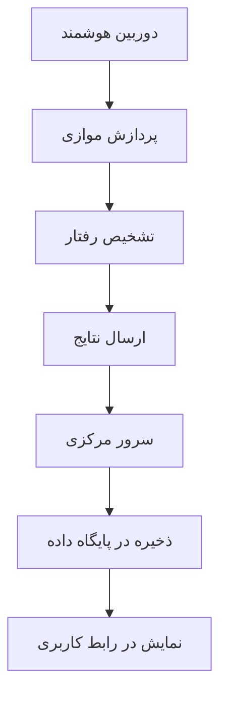

# تشخیص رفتار غیرعادی راننده با استفاده از شبکه عصبی عمیق برروی کامپیوترهای کوچک

## چکیده
در این پژوهش، یک دوربین هوشمند با قابلیت یادگیری مفهوم و پردازش داخلی طراحی شده است که از یک بستر ارتباطی پرسرعت برخوردار است که هزینه انتقال تصاویر را به حداقل می رساند. در این دوربین از ساختار پردازش موازی بر روی دو پردازنده به صورت همزمان استفاده می شود. همچنین، با استفاده از الگوریتم طبقه‌بند افزایشی بر روی وزن‌های طبقه‌بندی برگرفته از هر دوربین، وزن‌های داخلی همه آنها در بازه‌های زمانی تعریف شده، به صورت برخط به‌روزرسانی می‌گردد.

## مقدمه
انگیزه طراحی و ساخت چنین سیستمی، ایجاد بستری هوشمند برای سیستم‌های نظارت تصویری و آنلاین است که بتواند بدون نیاز به حضور نیروی انسانی و به صورت مستمر و هوشمند، محیط را پردازش کند.

## سیستم پیشنهادی

    

طرح‌واره روش زمان ورود

### فلوچارت روش پیشنهادی
سیستم از دو بخش کلی تشکیل شده است:
- **بخش داخل خودرو**:
  - سخت افزار
  - الگوریتم تشخیص
- **سرور مرکزی (بخش خارجی خودرو)**:
  - رابط کاربری گرافیکی (GUI)
  - بانک اطلاعاتی

### روش پیشنهادی
اجزای اصلی سیستم:
1. ارائه ساختار و شکل ظاهری مناسب
2. سخت‌افزار مناسب شرایط محیطی
3. پردازش تصویر و سیستم یادگیر با دقت قابل قبول
4. پیاده‌سازی بستر مخابراتی
5. پایگاه‌داده برای ذخیره‌سازی
6. رابط گرافیکی برای تحلیل اطلاعات

    

محاسبه پارامترهای بهینه

### تهیه سخت افزار
قطعات استفاده شده:
- برد Raspberry Pi 3
- برد Tinker Board
- دوربین ۸ مگاپیکسل دید در شب
- سنسورهای مادون قرمز
- مودم اینترنت همراه
- حافظه ۳۲ گیگابایتی

<html lang="fa" dir="rtl">
<head>
    <meta charset="UTF-8">
    <meta name="viewport" content="width=device-width, initial-scale=1.0">
    <title>چیدمان ماتریسی تصاویر</title>
</head>
<body>
    

        <h1>نمایش سخت افزار</h1>
         

            

                
                
سخت افزار نمای 1

            

            

                
                
سخت افزار نمای 2

            

        

    

</body>
</html>

### طراحی نرم افزاری و سرور
- سرور تحت وب با حافظه ۱۴ گیگابایت
- پایگاه‌داده PostgreSQL
- فریم‌ورک Pyramid برای رابط کاربری
- نرم‌افزار تحت وب گرافیکی

<html lang="fa" dir="rtl">
<head>
    <meta charset="UTF-8">
    <meta name="viewport" content="width=device-width, initial-scale=1.0">
    <title>چیدمان ماتریسی تصاویر</title>
</head>
<body>
    

        <h1>برخی صفحات طراحی شده</h1>
         

            

                
                
سامانه هوشمند تشخیص تخلفات

            

            

                
                
مشخصات

            

        

    

</body>
</html>

### الگوریتم تشخیص
کلاس‌های تشخیص:
- رفتار عادی
- استعمال دخانیات
- صحبت کردن با تلفن همراه
- ارسال پیامک

مراحل پردازش:
1. پیش‌پردازش تصویر
2. استخراج ویژگی‌ها
3. طبقه‌بندی
4. ارسال نتیجه

### شبکه عصبی مورد استفاده
شبکه‌های مورد بررسی:
- AlexNet (دقت ۶۱٪)
- MobileNet (دقت ۶۳٪)
- ResNet50 (دقت ۶۷٪)
- DenseNet (دقت ۷۱٪) - انتخاب نهایی

## ارزیابی سیستم

### مجموعه داده
داده‌های جمع‌آوری شده:
- کلاس عادی: ۱۴۰۵۰ تصویر
- استعمال دخانیات: ۱۱۷۳۰ تصویر
- صحبت با تلفن: ۱۱۷۳۵ تصویر
- ارسال پیامک: ۱۳۶۴۵ تصویر
- مجموع: ۵۱۱۶۰ تصویر

<html lang="fa" dir="rtl">
<head>
    <meta charset="UTF-8">
    <meta name="viewport" content="width=device-width, initial-scale=1.0">
    <title>چیدمان ماتریسی تصاویر</title>
</head>
<body>
    

        <h1>رفتار غیرنرمال</h1>
         

            

                
                
رفتار غیرنرمال سیگار کشیدن

            

            

                
                
رفتار غیرنرمال نگاه کردن به موبایل در حین رانندگی

            

        

    

</body>
</html>

### نتایج
- دقت کلی سیستم: ۶۹٪
- دقت در داده‌های روز: ۷۱٪
- دقت در داده‌های شب: ۶۷٪
- بهبود دقت با روش افزایشی: به ۷۳٪

<html lang="fa" dir="rtl">
<head>
    <meta charset="UTF-8">
    <meta name="viewport" content="width=device-width, initial-scale=1.0">
    <title>چیدمان ماتریسی تصاویر</title>
</head>
<body>
    

        <h1>رفتار</h1>
         

            

                
                
رفتار نرمال 

            

            

                
                
رفتار غیرنرمال مکالمه با موبایل در حین رانندگی

            

        

    

</body>
</html>

## نتیجه‌گیری
سیستم طراحی شده توانست با موفقیت پیاده‌سازی شود و چالش‌های محیط واقعی را حل کند. این سیستم قابلیت توسعه برای کاربردهای دیگر مانند تشخیص سرقت و نظارت بر بیماران را دارد.

    

فلوچارت

## جزییات بیشتر در پایان نامه سید محمد حسینی کارشناسی ارشد از دانشگاه فردوسی مشهد 

